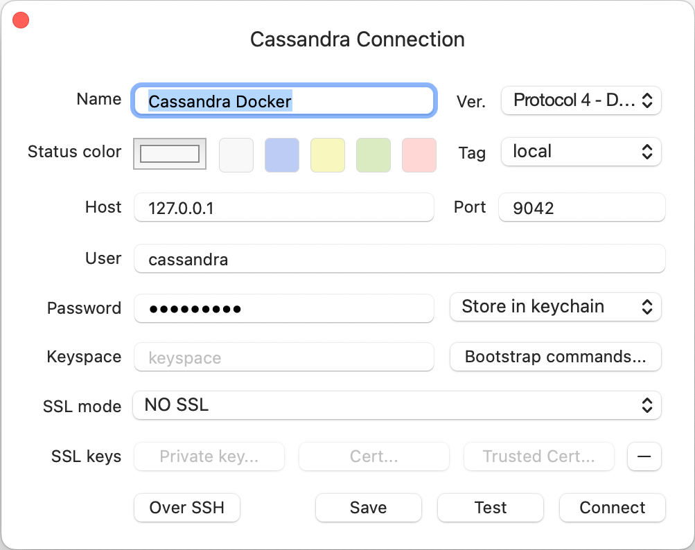

<h5 align="center">
  <a href="http://github.com/luisaveiro/localhost-databases" target="_blank">Localhost Databases</a>
</h5>

---

<p align="center">
  
</p>

<h4 align="center">
  Apache Cassandra is an open source NoSQL distributed database.
</h4>

<p align="center">
  <a href="#about">About</a> •
  <a href="#disclaimer">Disclaimer</a> •
  <a href="#getting-started">Getting Started</a> •
  <a href="#download">Download</a> •
  <a href="#how-to-use">How To Use</a>
</p>

---

## About

[Apache Cassandra](https://cassandra.apache.org) is an open source NoSQL 
distributed database that manages large amounts of data across commodity 
servers. It is a decentralized, scalable storage system designed to handle vast 
volumes of data across multiple commodity servers, providing high availability 
without a single point of failure.

You can learn about [Cassandra in 100 Seconds](https://youtu.be/ziq7FUKpCS8) by 
watching [Fireship YouTube channel](https://www.youtube.com/@Fireship).

## Disclaimer

> **Note**  
> ***Localhost Databases*** is not affiliated with the databases' 
developers/owners and is not an official product.

***Localhost Databases*** has been developed to run databases in a local 
Docker environment. To install a production instance, read the databases' 
respective installation guides.

## Getting Started

You will need to make sure your system meets the following prerequisites:

- Docker Engine >= 20.10.0

This repository utilizes [Docker](https://www.docker.com/) to run the Cassandra 
sample. So, before using the Cassandra, make sure you have Docker installed on 
your system.

## Download

To use Cassandra, you can clone the latest version of ***Localhost Databases*** 
repository for macOS, Linux and Windows.

```bash
# Clone this repository.
$ git clone git@github.com:luisaveiro/localhost-databases.git --branch main --single-branch
```

You can locate the Cassandra Docker configuration in the `databases` directory.

```bash
# Navigate to the Cassandra folder.
$ cd localhost-databases/databases/cassandra
```

## How To Use

There are a few steps you need to follow before you can have an Cassandra database 
set up and running in Docker container. I have outline the steps you would need 
to take to get started.

#### 1. **Environment Variables**

Before you start a database in a Docker container, you will need to create a 
DotEnv file. The DotEnv file will allow you to configure your database's 
credentials and map a container's port.

***Localhost Databases*** includes a `.env.example` file for Cassandra Database. You 
can run the following command in the terminal to create your DotEnv file.

```bash
# Navigate to a database.
$ cd databases/cassandra

# Create .env from .env.example.
$ cp .env.example .env
```

The Cassandra Docker Compose file uses the follow variables from the DotEnv 
file.

```ini
#--------------------------------------------------------------------------
# Docker env
#--------------------------------------------------------------------------

# The project name. | default: cassandra
APP_NAME="cassandra"

#--------------------------------------------------------------------------
# Database (Cassandra) env
#--------------------------------------------------------------------------

# The Cassandra database container name. | default: cassandra_db
DB_CONTAINER_NAME="${APP_NAME}_db"

#--------------------------------------------------------------------------
# Network env
#--------------------------------------------------------------------------

# Map the database container exposed port to the host port. | default: 9042
DB_PORT=9042

# The Docker network for the containers. | default: local_dbs_network
NETWORK_NAME="local_dbs_network"

#--------------------------------------------------------------------------
# Volume env
#--------------------------------------------------------------------------

# The database container data volume. | default: cassandra_db_data
DB_VOLUME_DATA_NAME="${DB_CONTAINER_NAME}_data"
```

> **Note**  
> You are unable to create additional users via the Cassandra Docker image 
environment variables.

#### 2. **Start Docker container**

To start the Cassandra Local container, you can run the following command:

```bash
# Navigate to Cassandra database.
$ cd databases/cassandra

# Run Docker Compose command.
$ docker compose up -d
```

##### Expected result

To check the Cassandra container is running and the port mapping is configured 
correctly, you can run the following command:

```bash
# List containers
$ docker ps  
```

You should see a similar output.

```bash
CONTAINER ID   IMAGE              COMMAND                  CREATED              STATUS              PORTS                                                       NAMES
4f5ffb447035   cassandra:latest   "docker-entrypoint.s…"   About a minute ago   Up About a minute   7000-7001/tcp, 7199/tcp, 9160/tcp, 0.0.0.0:9042->9042/tcp   cassandra_db
```

#### 3. **Stop Docker container**

To stop the Cassandra Local container, you can run the following command:

```bash
$ docker compose down
```

#### 4. **Connect to Database**

To connect to your Cassandra container from your database client, you will 
need to provide the following settings:

```ini
HOST=127.0.0.1
PORT="${DB_PORT}"

USER="cassandra"
PASSWORD="cassandra"
```

> **Note**  
> The `cassandra` user is the system administrator account on the Cassandra 
Server instance that's created during setup.

##### Expected result

Below is a screenshot of the settings used in TablePlus:

<p align="center">
  <a>
    
  </a>
  <br>
  <sub><sup>TablePlus settings for Cassandra.</sup></sub>
</p>

---

<p align="center">
  <a href="http://github.com/luisaveiro" target="_blank">GitHub</a> •
  <a href="https://uk.linkedin.com/in/luisaveiro" target="_blank">LinkedIn</a> •
  <a href="https://twitter.com/luisdeaveiro" target="_blank">Twitter</a>
</p>
