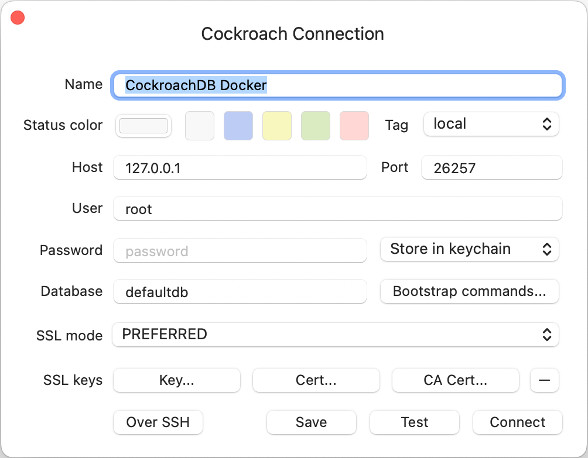
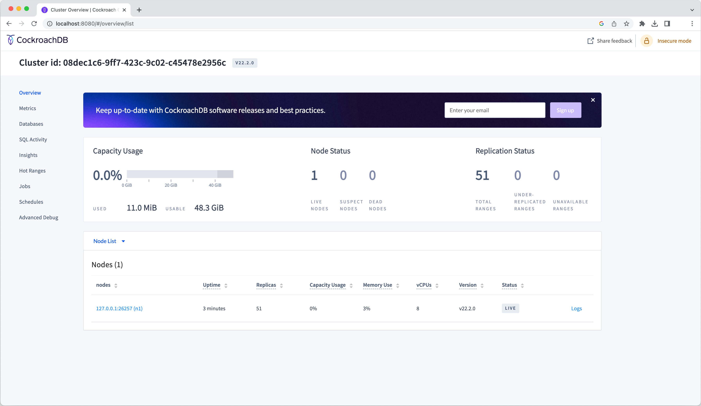

<h5 align="center">
  <a href="http://github.com/luisaveiro/localhost-databases" target="_blank">Localhost Databases</a>
</h5>

---

<p align="center">
  
</p>

<h4 align="center">
  CockroachDB is a distributed database with standard SQL for cloud applications.
</h4>

<p align="center">
  <a href="#about">About</a> •
  <a href="#disclaimer">Disclaimer</a> •
  <a href="#getting-started">Getting Started</a> •
  <a href="#download">Download</a> •
  <a href="#how-to-use">How To Use</a>
</p>

---

## About

[CockroachDB](https://www.cockroachlabs.com/) is a distributed database with 
standard SQL for cloud applications.

## Disclaimer

> [!IMPORTANT]  
> ***Localhost Databases*** is not affiliated with the databases' 
developers/owners and is not an official product.

***Localhost Databases*** has been developed to run databases in a local 
Docker environment. To install a production instance, read the databases' 
respective installation guides.

## Getting Started

You will need to make sure your system meets the following prerequisites:

- Docker Engine >= 20.10.0

This repository utilizes [Docker](https://www.docker.com/) to run the CockroachDB 
sample. So, before using the CockroachDB, make sure you have Docker installed on 
your system.

## Download

To use CockroachDB, you can clone the latest version of ***Localhost Databases*** 
repository for macOS, Linux and Windows.

```bash
# Clone this repository.
$ git clone git@github.com:luisaveiro/localhost-databases.git --branch main --single-branch
```

You can locate the CockroachDB Docker configuration in the `databases` directory.

```bash
# Navigate to the CockroachDB folder.
$ cd localhost-databases/databases/cockroachdb
```

## How To Use

There are a few steps you need to follow before you can have an CockroachDB database 
set up and running in Docker container. I have outline the steps you would need 
to take to get started.

#### 1. **Environment Variables**

Before you start a database in a Docker container, you will need to create a 
DotEnv file. The DotEnv file will allow you to configure your database's 
credentials and map a container's port.

***Localhost Databases*** includes a `.env.example` file for CockroachDB Database. You 
can run the following command in the terminal to create your DotEnv file.

```bash
# Navigate to a database.
$ cd databases/cockroachdb

# Create .env from .env.example.
$ cp .env.example .env
```

The CockroachDB Docker Compose file uses the follow variables from the DotEnv 
file.

```ini
#--------------------------------------------------------------------------
# Docker env
#--------------------------------------------------------------------------

# The project name. | default: cockroachdb
APP_NAME="cockroachdb"

#--------------------------------------------------------------------------
# Database (CockroachDB) env
#--------------------------------------------------------------------------

# The CockroachDB database container name. | default: cockroachdb
DB_CONTAINER_NAME="${APP_NAME}"

#--------------------------------------------------------------------------
# Network env
#--------------------------------------------------------------------------

# Map the database container exposed port to the host port. | default: 26257
DB_PORT=26257

# Map the database container UI port to the host port. | default: 8080
DB_UI_PORT=8080

# The Docker network for the containers. | default: local_dbs_network
NETWORK_NAME="local_dbs_network"

#--------------------------------------------------------------------------
# Volume env
#--------------------------------------------------------------------------

# The database container data volume. | default: cockroachdb_data
DB_VOLUME_DATA_NAME="${DB_CONTAINER_NAME}_data"
```

#### 2. **Start Docker container**

To start the CockroachDB container, you can run the following command:

```bash
# Navigate to CockroachDB database.
$ cd databases/cockroachdb

# Run Docker Compose command.
$ docker compose up -d
```

##### Expected result

To check the CockroachDB container is running and the port mapping is configured 
correctly, you can run the following command:

```bash
# List containers
$ docker ps  
```

You should see a similar output.

```bash
CONTAINER ID   IMAGE                          COMMAND                  CREATED         STATUS         PORTS                                              NAMES
f13be1d44597   cockroachdb/cockroach:latest   "/cockroach/cockroac…"   9 seconds ago   Up 7 seconds   0.0.0.0:8080->8080/tcp, 0.0.0.0:26257->26257/tcp   cockroachdb
```

#### 3. **Stop Docker container**

To stop the CockroachDB container, you can run the following command:

```bash
$ docker compose down
```

#### 4. **Connect to Database**

To connect to your CockroachDB container from your database client, you will 
need to provide the following settings:

```ini
HOST=127.0.0.1
PORT="${DB_PORT}"

USER="root"
```

> [!TIP]  
> The CockroachDB root user does not have a password.

##### Expected result

Below is a screenshot of the settings used in TablePlus:

<p align="center">
  <a>
    
  </a>
  <br>
  <sub><sup>TablePlus settings for cockroachdb.</sup></sub>
</p>

##### **Connect to DB Console**

The CockroachDB has a DB Console that gives you insight into the overall health 
of your cluster as well as the performance of the client workload. Go to 
http://localhost:8080.

Below is a screenshot of the DB Console:

<p align="center">
  <a>
    
  </a>
  <br>
  <sub><sup>CockroachDB DB Console.</sup></sub>
</p>

---

<p align="center">
  <a href="http://github.com/luisaveiro" target="_blank">GitHub</a> •
  <a href="https://uk.linkedin.com/in/luisaveiro" target="_blank">LinkedIn</a> •
  <a href="https://twitter.com/luisdeaveiro" target="_blank">Twitter</a>
</p>
