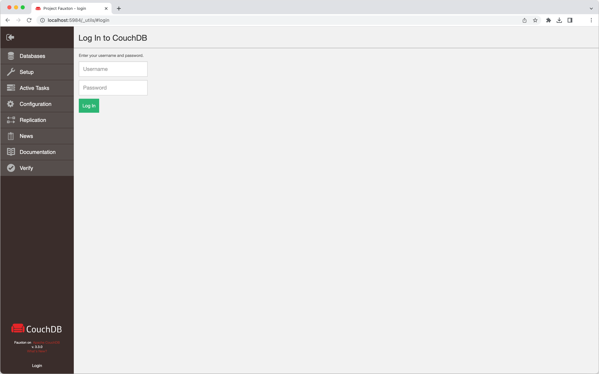

<h5 align="center">
  <a href="http://github.com/luisaveiro/localhost-databases" target="_blank">Localhost Databases</a>
</h5>

---

<p align="center">
  
</p>

<h4 align="center">
  Apache CouchDB is a document-oriented NoSQL database.
</h4>

<p align="center">
  <a href="#about">About</a> •
  <a href="#disclaimer">Disclaimer</a> •
  <a href="#getting-started">Getting Started</a> •
  <a href="#download">Download</a> •
  <a href="#how-to-use">How To Use</a>
</p>

---

## About

[Apache CouchDB](https://couchdb.apache.org/) is an open-source document-oriented 
NoSQL database, implemented in Erlang. CouchDB uses multiple formats and protocols 
to store, transfer, and process its data. It uses JSON to store data, JavaScript 
as its query language using MapReduce, and HTTP for an API.

## Disclaimer

> **Note**  
> ***Localhost Databases*** is not affiliated with the databases' 
developers/owners and is not an official product.

***Localhost Databases*** has been developed to run databases in a local 
Docker environment. To install a production instance, read the databases' 
respective installation guides.

## Getting Started

You will need to make sure your system meets the following prerequisites:

- Docker Engine >= 20.10.0

This repository utilizes [Docker](https://www.docker.com/) to run the CouchDB 
sample. So, before using the CouchDB, make sure you have Docker installed on 
your system.

## Download

To use CouchDB, you can clone the latest version of ***Localhost Databases*** 
repository for macOS, Linux and Windows.

```bash
# Clone this repository.
$ git clone git@github.com:luisaveiro/localhost-databases.git --branch main --single-branch
```

You can locate the CouchDB Docker configuration in the `databases` directory.

```bash
# Navigate to the CouchDB folder.
$ cd localhost-databases/databases/couchdb
```

## How To Use

There are a few steps you need to follow before you can have an CouchDB database 
set up and running in Docker container. I have outline the steps you would need 
to take to get started.

#### 1. **Environment Variables**

Before you start a database in a Docker container, you will need to create a 
DotEnv file. The DotEnv file will allow you to configure your database's 
credentials and map a container's port.

***Localhost Databases*** includes a `.env.example` file for CouchDB Database. You 
can run the following command in the terminal to create your DotEnv file.

```bash
# Navigate to a database.
$ cd databases/couchdb

# Create .env from .env.example.
$ cp .env.example .env
```

The CouchDB Docker Compose file uses the follow variables from the DotEnv 
file.

```ini
#--------------------------------------------------------------------------
# Docker env
#--------------------------------------------------------------------------

# The project name. | default: couchdb
APP_NAME="couchdb"

#--------------------------------------------------------------------------
# Database (CouchDB) env
#--------------------------------------------------------------------------

# The CouchDB database container name. | default: couchdb
DB_CONTAINER_NAME="${APP_NAME}"

# The CouchDB database user credentials.
DB_USERNAME=""
DB_PASSWORD=""

#--------------------------------------------------------------------------
# Network env
#--------------------------------------------------------------------------

# Map the database container exposed port to the host port. | default: 5984
DB_PORT=5984

# The Docker network for the containers. | default: local_dbs_network
NETWORK_NAME="local_dbs_network"

#--------------------------------------------------------------------------
# Volume env
#--------------------------------------------------------------------------

# The database container data volume. | default: couchdb_data
DB_VOLUME_DATA_NAME="${DB_CONTAINER_NAME}_data"
```

#### 2. **Start Docker container**

To start the CouchDB container, you can run the following command:

```bash
# Navigate to CouchDB database.
$ cd databases/couchdb

# Run Docker Compose command.
$ docker compose up -d
```

##### Expected result

To check the CouchDB container is running and the port mapping is configured 
correctly, you can run the following command:

```bash
# List containers
$ docker ps  
```

You should see a similar output.

```bash
CONTAINER ID   IMAGE            COMMAND                  CREATED              STATUS              PORTS                                        NAMES
8ad2865f5be1   couchdb:latest   "tini -- /docker-ent…"   About a minute ago   Up About a minute   4369/tcp, 9100/tcp, 0.0.0.0:5984->5984/tcp   couchdb
```

#### 3. **Stop Docker container**

To stop the CouchDB container, you can run the following command:

```bash
$ docker compose down
```

#### 4. **Connect to Database**

Fauxton is a native web-based interface built into CouchDB. It provides a basic 
interface to the majority of the functionality, including the ability to create, 
update, delete and view documents and design documents. It provides access to 
the configuration parameters, and an interface for initiating replication.To 
connect to your EdgeDB CouchDB from your browser, you will need to provide the 
following settings:

```ini
HOST=localhost
PORT="${DB_PORT}"

USER="${DB_USERNAME}"
PASSWORD="${DB_PASSWORD}"
```

You can access CouchDB Fauxton UI in your web browser at: http://localhost:5984/_utils.

##### Expected result

Below is a screenshot of the Fauxton UI:

<p align="center">
  <a>
  
  </a>
  <br>
  <sub><sup>CouchDB Fauxton UI.</sup></sub>
</p>

---

<p align="center">
  <a href="http://github.com/luisaveiro" target="_blank">GitHub</a> •
  <a href="https://uk.linkedin.com/in/luisaveiro" target="_blank">LinkedIn</a> •
  <a href="https://twitter.com/luisdeaveiro" target="_blank">Twitter</a>
</p>
