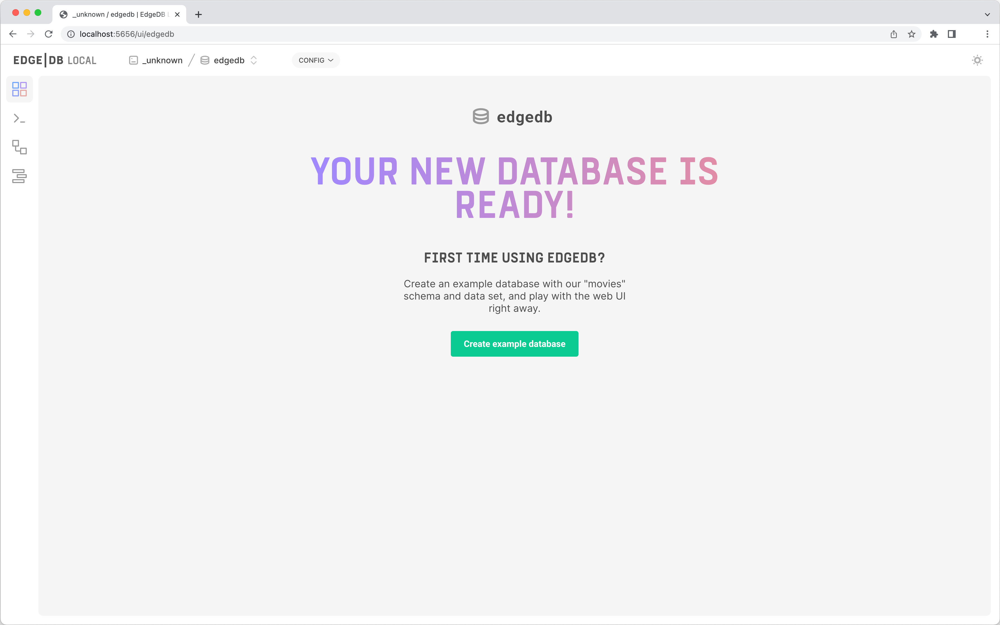

<h5 align="center">
  <a href="http://github.com/luisaveiro/localhost-databases" target="_blank">Localhost Databases</a>
</h5>

---

<p align="center">
  
</p>

<h4 align="center">
  EdgeDB is a spiritual successor to SQL and the relational paradigm.
</h4>

<p align="center">
  <a href="#about">About</a> •
  <a href="#disclaimer">Disclaimer</a> •
  <a href="#getting-started">Getting Started</a> •
  <a href="#download">Download</a> •
  <a href="#how-to-use">How To Use</a>
</p>

---

## About

[EdgeDB](https://www.edgedb.com) is an open-source database designed as a 
spiritual successor to SQL and the relational paradigm. Powered by the Postgres 
query engine.

## Disclaimer

> [!IMPORTANT]  
> ***Localhost Databases*** is not affiliated with the databases' 
developers/owners and is not an official product.

***Localhost Databases*** has been developed to run databases in a local 
Docker environment. To install a production instance, read the databases' 
respective installation guides.

## Getting Started

You will need to make sure your system meets the following prerequisites:

- Docker Engine >= 20.10.0

This repository utilizes [Docker](https://www.docker.com/) to run the EdgeDB 
sample. So, before using the EdgeDB, make sure you have Docker installed on 
your system.

## Download

To use EdgeDB, you can clone the latest version of ***Localhost Databases*** 
repository for macOS, Linux and Windows.

```bash
# Clone this repository.
$ git clone git@github.com:luisaveiro/localhost-databases.git --branch main --single-branch
```

You can locate the EdgeDB Docker configuration in the `databases` directory.

```bash
# Navigate to the EdgeDB folder.
$ cd localhost-databases/databases/edgedb
```

## How To Use

There are a few steps you need to follow before you can have an EdgeDB database 
set up and running in Docker container. I have outline the steps you would need 
to take to get started.

#### 1. **Environment Variables**

Before you start a database in a Docker container, you will need to create a 
DotEnv file. The DotEnv file will allow you to configure your database's 
credentials and map a container's port.

***Localhost Databases*** includes a `.env.example` file for EdgeDB Database. You 
can run the following command in the terminal to create your DotEnv file.

```bash
# Navigate to a database.
$ cd databases/edgedb

# Create .env from .env.example.
$ cp .env.example .env
```

The EdgeDB Docker Compose file uses the follow variables from the DotEnv 
file.

```ini
#--------------------------------------------------------------------------
# Docker env
#--------------------------------------------------------------------------

# The project name. | default: edgedb
APP_NAME="edgedb"

#--------------------------------------------------------------------------
# Database (EdgeDB) env
#--------------------------------------------------------------------------

# The EdgeDB database container name. | default: edgedb
DB_CONTAINER_NAME="${APP_NAME}"

# The EdgeDB database root credentials.
DB_ROOT_PASSWORD=""

#--------------------------------------------------------------------------
# Network env
#--------------------------------------------------------------------------

# Map the database container exposed port to the host port. | default: 5656
DB_PORT=5656

# The Docker network for the containers. | default: local_dbs_network
NETWORK_NAME="local_dbs_network"

#--------------------------------------------------------------------------
# Volume env
#--------------------------------------------------------------------------

# The database container data volume. | default: edgedb_data
DB_VOLUME_DATA_NAME="${DB_CONTAINER_NAME}_data"

# The database container schema volume. | default: edgedb_schema
DB_VOLUME_SCHEMA_NAME="${DB_CONTAINER_NAME}_schema"
```

> [!TIP]  
> EdgeDB root username is `edgedb`.

For a list of available environment variables that the EdgeDB Docker image 
supports, you can visit [EdgeDB Documentation](https://www.edgedb.com/docs/reference/environment#ref-reference-environment) 
page.

#### 2. **Start Docker container**

To start the EdgeDB container, you can run the following command:

```bash
# Navigate to EdgeDB database.
$ cd databases/edgedb

# Run Docker Compose command.
$ docker compose up -d
```

##### Expected result

To check the EdgeDB container is running and the port mapping is configured 
correctly, you can run the following command:

```bash
# List containers
$ docker ps  
```

You should see a similar output.

```bash
CONTAINER ID   IMAGE                  COMMAND                  CREATED         STATUS         PORTS                    NAMES
7c725acbeeb6   edgedb/edgedb:latest   "docker-entrypoint.s…"   9 seconds ago   Up 8 seconds   0.0.0.0:5656->5656/tcp   edgedb
```

#### 3. **Stop Docker container**

To stop the EdgeDB container, you can run the following command:

```bash
$ docker compose down
```

#### 4. **Connect to Database**

EdgeDB Admin UI is a developer-focused tool that allows you to execute EdgeQL 
queries and visualize the results. To connect to your EdgeDB container from your 
browser, you will need to provide the following settings:

```ini
HOST=localhost
PORT="${DB_PORT}"

USER="edgedb"
PASSWORD="${DB_ROOT_PASSWORD}"
```

You can access EdgeDB Admin UI in your web browser at: http://localhost:5656.

##### Expected result

Below is a screenshot of EdgeDB Admin UI:

<p align="center">
  <a>
    
  </a>
  <br>
  <sub><sup>EdgeDB Admin UI.</sup></sub>
</p>

---

<p align="center">
  <a href="http://github.com/luisaveiro" target="_blank">GitHub</a> •
  <a href="https://uk.linkedin.com/in/luisaveiro" target="_blank">LinkedIn</a> •
  <a href="https://twitter.com/luisdeaveiro" target="_blank">Twitter</a>
</p>
