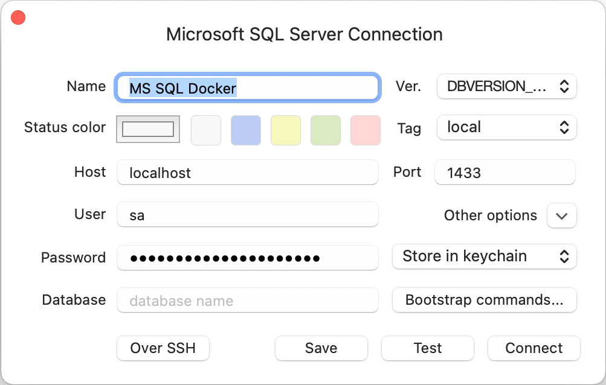

<h5 align="center">
  <a href="http://github.com/luisaveiro/localhost-databases" target="_blank">Localhost Databases</a>
</h5>

---

<p align="center">
  
</p>

<h4 align="center">
  Microsoft SQL Server is a relational database management system.
</h4>

<p align="center">
  <a href="#about">About</a> •
  <a href="#disclaimer">Disclaimer</a> •
  <a href="#getting-started">Getting Started</a> •
  <a href="#download">Download</a> •
  <a href="#how-to-use">How To Use</a>
</p>

---

## About

[Microsoft SQL Server (MSSQL)](https://www.microsoft.com/en-gb/sql-server/) is a 
relational database management system developed by Microsoft.

> **Note**
> : MSSQL is not support on Apple Silicon. There is an open 
[GitHub issue](https://github.com/microsoft/mssql-docker/issues/734).

## Disclaimer

> **Note**  
> ***Localhost Databases*** is not affiliated with the databases' 
developers/owners and is not an official product.

***Localhost Databases*** has been developed to run databases in a local 
Docker environment. To install a production instance, read the databases' 
respective installation guides.

## Getting Started

You will need to make sure your system meets the following prerequisites:

- Docker Engine >= 20.10.0

This repository utilizes [Docker](https://www.docker.com/) to run the MSSQL 
sample. So, before using the MSSQL, make sure you have Docker installed on 
your system.

## Download

To use MSSQL, you can clone the latest version of ***Localhost Databases*** 
repository for macOS, Linux and Windows.

```bash
# Clone this repository.
$ git clone git@github.com:luisaveiro/localhost-databases.git --branch main --single-branch
```

You can locate the MSSQL Docker configuration in the `databases` directory.

```bash
# Navigate to the MSSQL folder.
$ cd localhost-databases/databases/mssql
```

## How To Use

There are a few steps you need to follow before you can have an MSSQL database 
set up and running in Docker container. I have outline the steps you would need 
to take to get started.

#### 1. **Environment Variables**

Before you start a database in a Docker container, you will need to create a 
DotEnv file. The DotEnv file will allow you to configure your database's 
credentials and map a container's port.

***Localhost Databases*** includes a `.env.example` file for MSSQL Database. You 
can run the following command in the terminal to create your DotEnv file.

```bash
# Navigate to a database.
$ cd databases/mssql

# Create .env from .env.example.
$ cp .env.example .env
```

The MSSQL Docker Compose file uses the follow variables from the DotEnv 
file.

```ini
#--------------------------------------------------------------------------
# Docker env
#--------------------------------------------------------------------------

# The project name. | default: mssql
APP_NAME="mssql"

#--------------------------------------------------------------------------
# Database (Microsoft SQL Server - MSSQL) env
#--------------------------------------------------------------------------

# The MSSQL database container name. | default: mssql_db
DB_CONTAINER_NAME="${APP_NAME}_db"

# The MSSQL database root credentials.
DB_ROOT_PASSWORD=""

# The Product ID (PID) or Edition | default: Developer
MSSQL_PID="Developer"

#--------------------------------------------------------------------------
# Network env
#--------------------------------------------------------------------------

# Map the database container exposed port to the host port. | default: 1433
DB_PORT=1433

# The Docker network for the containers. | default: local_dbs_network
NETWORK_NAME="local_dbs_network"

#--------------------------------------------------------------------------
# Volume env
#--------------------------------------------------------------------------

# The database container data volume. | default: mssql_db_data
DB_VOLUME_DATA_NAME="${DB_CONTAINER_NAME}_data"
```

> **Note**  
> The MSSQL password needs to include at least 8 characters of 
at least three of these four categories: uppercase letters, lowercase letters, 
numbers and non-alphanumeric symbols.

For a list of available environment variables that the MSSQL Docker image 
supports, you can visit [SQL Docs](https://docs.microsoft.com/en-us/sql/linux/sql-server-linux-configure-environment-variables?view=sql-server-ver15) 
page.

#### 2. **Start Docker container**

To start the MSSQL container, you can run the following command:

```bash
# Navigate to MSSQL database.
$ cd databases/mssql

# Run Docker Compose command.
$ docker compose up -d
```

##### Expected result

To check the MSSQL container is running and the port mapping is configured 
correctly, you can run the following command:

```bash
# List containers
$ docker ps  
```

You should see a similar output.

```bash
CONTAINER ID   IMAGE                                        COMMAND                  CREATED         STATUS         PORTS                    NAMES
40e041a64d71   mcr.microsoft.com/mssql/server:2019-latest   "/opt/mssql/bin/perm…"   5 seconds ago   Up 4 seconds   0.0.0.0:1433->1433/tcp   mssql_db
```

#### 3. **Stop Docker container**

To stop the MSSQL container, you can run the following command:

```bash
$ docker compose down
```

#### 4. **Connect to Database**

To connect to your MSSQL container from your database client, you will 
need to provide the following settings:

```ini
HOST=127.0.0.1
PORT="${DB_PORT}"

USER="sa"
PASSWORD="${DB_ROOT_PASSWORD}"
```

> **Note**  
> The `SA` user is the system administrator account on the MSSQL Server instance 
that's created during setup.

##### Expected result

Below is a screenshot of the settings used in TablePlus:

<p align="center">
  <a>
    
  </a>
  <br>
  <sub><sup>TablePlus settings for MSSQL.</sup></sub>
</p>

---

<p align="center">
  <a href="http://github.com/luisaveiro" target="_blank">GitHub</a> •
  <a href="https://uk.linkedin.com/in/luisaveiro" target="_blank">LinkedIn</a> •
  <a href="https://twitter.com/luisdeaveiro" target="_blank">Twitter</a>
</p>
