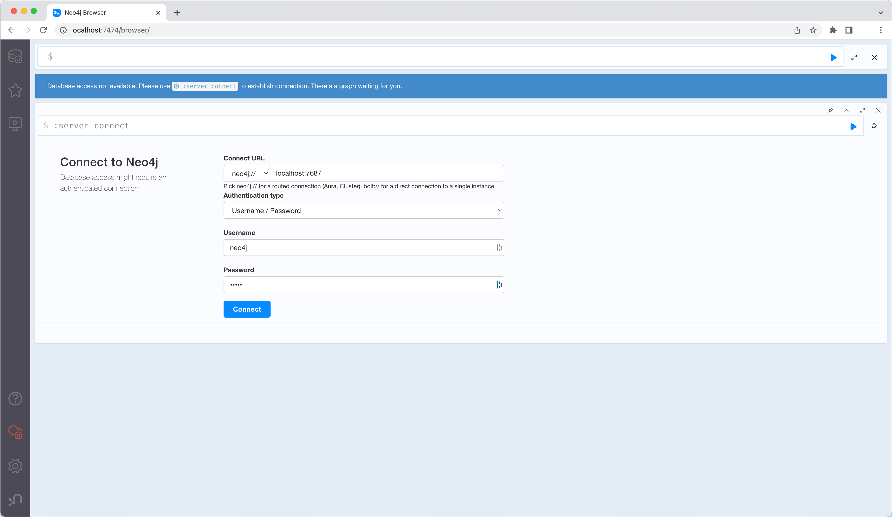

<h5 align="center">
  <a href="http://github.com/luisaveiro/localhost-databases" target="_blank">Localhost Databases</a>
</h5>

---

<p align="center">
  
</p>

<h4 align="center">
  Neo4j is a NoSQL, native graph database management system.
</h4>

<p align="center">
  <a href="#about">About</a> •
  <a href="#disclaimer">Disclaimer</a> •
  <a href="#getting-started">Getting Started</a> •
  <a href="#download">Download</a> •
  <a href="#how-to-use">How To Use</a>
</p>

---

## About

[Neo4j](https://neo4j.com/) is an open-source, NoSQL, native graph database 
management system that provides an ACID-compliant transactional backend for 
your applications that has been publicly available since 2007.

You can learn about [Neo4j in 100 Seconds](https://youtu.be/T6L9EoBy8Zk) by 
watching [Fireship YouTube channel](https://www.youtube.com/@Fireship).

## Disclaimer

> [!IMPORTANT]  
> ***Localhost Databases*** is not affiliated with the databases' 
developers/owners and is not an official product.

***Localhost Databases*** has been developed to run databases in a local 
Docker environment. To install a production instance, read the databases' 
respective installation guides.

## Getting Started

You will need to make sure your system meets the following prerequisites:

- Docker Engine >= 20.10.0

This repository utilizes [Docker](https://www.docker.com/) to run the Neo4j 
sample. So, before using the Neo4j, make sure you have Docker installed on 
your system.

## Download

To use Neo4j, you can clone the latest version of ***Localhost Databases*** 
repository for macOS, Linux and Windows.

```bash
# Clone this repository.
$ git clone git@github.com:luisaveiro/localhost-databases.git --branch main --single-branch
```

You can locate the Neo4j Docker configuration in the `databases` directory.

```bash
# Navigate to the Neo4j folder.
$ cd localhost-databases/databases/neo4j
```

## How To Use

There are a few steps you need to follow before you can have an Neo4j database 
set up and running in Docker container. I have outline the steps you would need 
to take to get started.

#### 1. **Environment Variables**

Before you start a database in a Docker container, you will need to create a 
DotEnv file. The DotEnv file will allow you to configure your database's 
credentials and map a container's port.

***Localhost Databases*** includes a `.env.example` file for Neo4j Database. You 
can run the following command in the terminal to create your DotEnv file.

```bash
# Navigate to a database.
$ cd databases/neo4j

# Create .env from .env.example.
$ cp .env.example .env
```

The Neo4j Docker Compose file uses the follow variables from the DotEnv 
file.

```ini
#--------------------------------------------------------------------------
# Docker env
#--------------------------------------------------------------------------

# The project name. | default: neo4j
APP_NAME="neo4j"

#--------------------------------------------------------------------------
# Database (Neo4j) env
#--------------------------------------------------------------------------

# The Neo4j database container name. | default: neo4j_db
DB_CONTAINER_NAME="${APP_NAME}_db"

#--------------------------------------------------------------------------
# Network env
#--------------------------------------------------------------------------

# Map the database container exposed port to the host port. | default: 7474
DB_PORT=7474

# Map the database container exposed port to the host port. | default: 7687
DB_BOLT_PORT=7687

# The Docker network for the containers. | default: local_dbs_network
NETWORK_NAME="local_dbs_network"

#--------------------------------------------------------------------------
# Volume env
#--------------------------------------------------------------------------

# The database container data volume. | default: neo4j_db_data
DB_VOLUME_DATA_NAME="${DB_CONTAINER_NAME}_data"

# The database container logs volume. | default: neo4j_db_logs
DB_VOLUME_LOGS_NAME="${DB_CONTAINER_NAME}_data"
```

Neo4j configuration settings can be provided in the Neo4j Docker Compose file 
using the following naming scheme:

- Prefix with `NEO4J_`.
- Underscores must be written twice: `_` is written as `__`.
- Periods are converted to underscores: `.` is written as `_`.

As an example, `dbms.memory.pagecache.size` could be set by specifying the 
following argument in Neo4j Docker Compose file:

```yaml
services:
  neo4j:
    image: neo4j:latest
    environment:
      NEO4J_dbms_memory_pagecache_size=4G
```

For a list of available environment variables that the Neo4j Docker image 
supports, you can visit [Neo4j Configuration Settings](https://neo4j.com/docs/operations-manual/current/reference/configuration-settings/) 
page.

#### 2. **Start Docker container**

To start the Neo4j container, you can run the following command:

```bash
# Navigate to Neo4j database.
$ cd databases/neo4j

# Run Docker Compose command.
$ docker compose up -d
```

##### Expected result

To check the Neo4j container is running and the port mapping is configured 
correctly, you can run the following command:

```bash
# List containers
$ docker ps  
```

You should see a similar output.

```bash
CONTAINER ID   IMAGE          COMMAND                  CREATED          STATUS          PORTS                                                      NAMES
609a4519a515   neo4j:latest   "tini -g -- /startup…"   44 seconds ago   Up 42 seconds   0.0.0.0:7474->7474/tcp, 7473/tcp, 0.0.0.0:7687->7687/tcp   neo4j_db
```

#### 3. **Stop Docker container**

To stop the Neo4j container, you can run the following command:

```bash
$ docker compose down
```

#### 4. **Connect to Database**

Neo4j Browser is a developer-focused tool that allows you to execute Cypher 
queries and visualize the results. To connect to your Neo4j container from your 
browser, you will need to provide the following settings:

```ini
HOST=localhost
PORT="${DB_PORT}"

USER="neo4j"
PASSWORD="neo4j"
```

You can access Neo4j Browser in your web browser at: http://localhost:7474.

##### Expected result

Below is a screenshot of Neo4j Browser:

<p align="center">
  <a>
    
  </a>
  <br>
  <sub><sup>Neo4j Browser.</sup></sub>
</p>

---

<p align="center">
  <a href="http://github.com/luisaveiro" target="_blank">GitHub</a> •
  <a href="https://uk.linkedin.com/in/luisaveiro" target="_blank">LinkedIn</a> •
  <a href="https://twitter.com/luisdeaveiro" target="_blank">Twitter</a>
</p>
