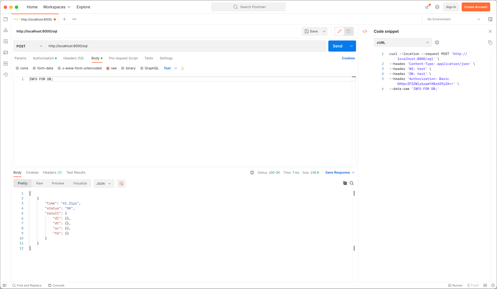

<h5 align="center">
  <a href="http://github.com/luisaveiro/localhost-databases" target="_blank">Localhost Databases</a>
</h5>

---

<p align="center">
  
</p>

<h4 align="center">
  SurrealDB is an innovative NewSQL cloud database .
</h4>

<p align="center">
  <a href="#about">About</a> •
  <a href="#disclaimer">Disclaimer</a> •
  <a href="#getting-started">Getting Started</a> •
  <a href="#download">Download</a> •
  <a href="#how-to-use">How To Use</a>
</p>

---

## About

[SurrealDB](https://surrealdb.com/), is an innovative NewSQL cloud database 
suitable for serverless, jamstack, single-page, and traditional applications.

You can learn about [SurrealDB in 100 Seconds](https://youtu.be/C7WFwgDRStM) by 
watching [Fireship YouTube channel](https://www.youtube.com/@Fireship).

## Disclaimer

> [!IMPORTANT]  
> ***Localhost Databases*** is not affiliated with the databases' 
developers/owners and is not an official product.

***Localhost Databases*** has been developed to run databases in a local 
Docker environment. To install a production instance, read the databases' 
respective installation guides.

## Getting Started

You will need to make sure your system meets the following prerequisites:

- Docker Engine >= 20.10.0

This repository utilizes [Docker](https://www.docker.com/) to run the SurrealDB 
sample. So, before using the SurrealDB, make sure you have Docker installed on 
your system.

## Download

To use SurrealDB, you can clone the latest version of ***Localhost Databases*** 
repository for macOS, Linux and Windows.

```bash
# Clone this repository.
$ git clone git@github.com:luisaveiro/localhost-databases.git --branch main --single-branch
```

You can locate the Redis Docker configuration in the `databases` directory.

```bash
# Navigate to the SurrealDB folder.
$ cd localhost-databases/databases/surrealdb
```

## How To Use

There are a few steps you need to follow before you can have an SurrealDB database 
set up and running in Docker container. I have outline the steps you would need 
to take to get started.

#### 1. **Environment Variables**

Before you start a database in a Docker container, you will need to create a 
DotEnv file. The DotEnv file will allow you to configure your database's 
credentials and map a container's port.

***Localhost Databases*** includes a `.env.example` file for SurrealDB Database. You 
can run the following command in the terminal to create your DotEnv file.

```bash
# Navigate to a database.
$ cd databases/surrealdb

# Create .env from .env.example.
$ cp .env.example .env
```

The SurrealDB Docker Compose file uses the follow variables from the DotEnv 
file.

```ini
#--------------------------------------------------------------------------
# Docker env
#--------------------------------------------------------------------------

# The project name. | default: surrealdb
APP_NAME="surrealdb"

#--------------------------------------------------------------------------
# Database (SurrealDB) env
#--------------------------------------------------------------------------

# The SurrealDB database container name. | default: surrealdb
DB_CONTAINER_NAME="${APP_NAME}"

# The SurrealDB database user credentials.
DB_USERNAME=""
DB_PASSWORD=""

#--------------------------------------------------------------------------
# Network env
#--------------------------------------------------------------------------

# Map the database container exposed port to the host port. | default: 8000
DB_PORT=8000

# The Docker network for the containers. | default: local_dbs_network
NETWORK_NAME="local_dbs_network"

#--------------------------------------------------------------------------
# Volume env
#--------------------------------------------------------------------------

# The database container data volume. | default: surrealdb_data
DB_VOLUME_DATA_NAME="${DB_CONTAINER_NAME}_data"
```

> [!NOTE]   
> The SurrealDB Docker image doesn't offer additional environment variables.

#### 2. **Start Docker container**

To start the SurrealDB container, you can run the following command:

```bash
# Navigate to SurrealDB database.
$ cd databases/surrealdb

# Run Docker Compose command.
$ docker compose up -d
```

##### Expected result

To check the SurrealDB container is running and the port mapping is configured 
correctly, you can run the following command:

```bash
# List containers
$ docker ps  
```

You should see a similar output.

```bash
CONTAINER ID   IMAGE                        COMMAND                  CREATED          STATUS          PORTS                    NAMES
0f216d93c518   surrealdb/surrealdb:latest   "/surreal start --lo…"   27 seconds ago   Up 26 seconds   0.0.0.0:8000->8000/tcp   surrealdb
```

#### 3. **Stop Docker container**

To stop the SurrealDB container, you can run the following command:

```bash
$ docker compose down
```

#### 4. **Connect to Database**

> [!NOTE]    
> TablePlus currently doesn't support SurrealDB. You can use Postman to run queries on SurrealDB.

To connect to your SurrealDB container from you HTTP request, you will need to 
provide the following settings:

```ini
PORT="${DB_PORT}"

USER="${DB_USERNAME}"
PASSWORD="${DB_PASSWORD}"
```

Below is a cURL request using the settings:

```bash
curl --request POST \
	--header "Content-Type: application/json" \
	--header "NS: test" \
	--header "DB: test" \
	--user "${DB_USERNAME}:${DB_PASSWORD}" \
	--data "INFO FOR DB;" \
	http://localhost:${DB_PORT}/sql
```

##### Expected result

Below is a screenshot of the settings used in Postman:

<p align="center">
  <a>
    
  </a>
  <br>
  <sub><sup>Postman settings for SurrealDB.</sup></sub>
</p>

---

<p align="center">
  <a href="http://github.com/luisaveiro" target="_blank">GitHub</a> •
  <a href="https://uk.linkedin.com/in/luisaveiro" target="_blank">LinkedIn</a> •
  <a href="https://twitter.com/luisdeaveiro" target="_blank">Twitter</a>
</p>
