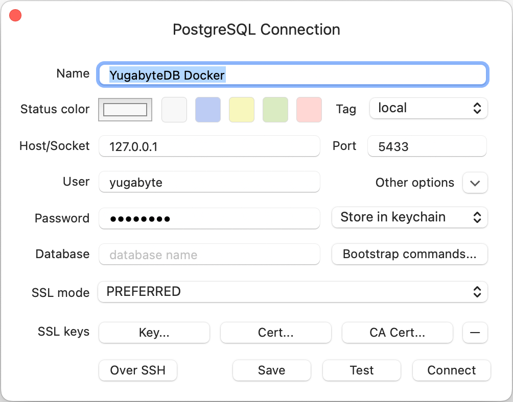
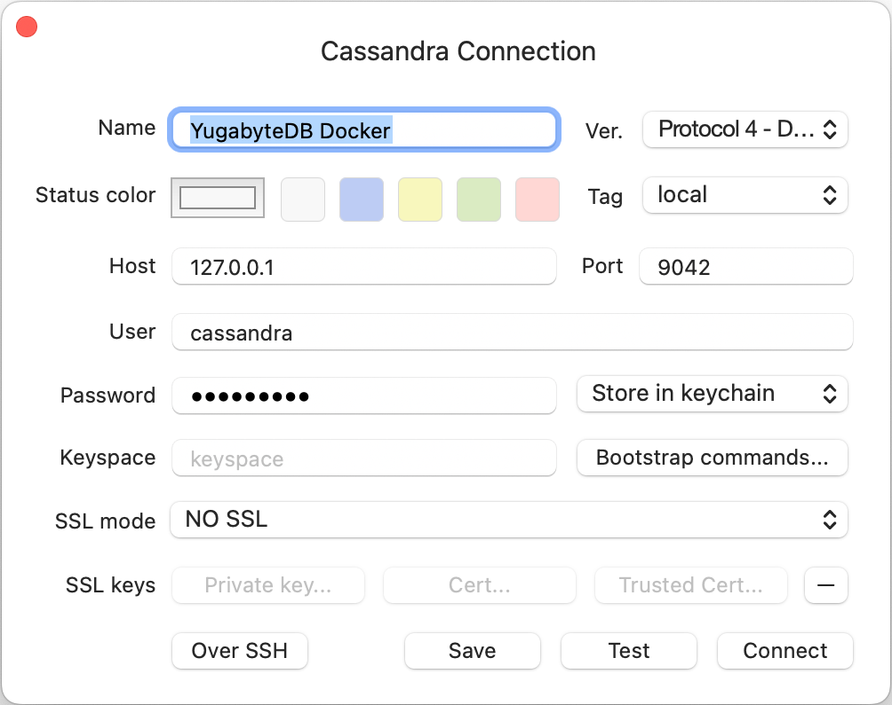

<h5 align="center">
  <a href="http://github.com/luisaveiro/localhost-databases" target="_blank">Localhost Databases</a>
</h5>

---

<p align="center">
  
</p>

<h4 align="center">
  YugabyteDB is a high-performance distributed SQL database.
</h4>

<p align="center">
  <a href="#about">About</a> •
  <a href="#disclaimer">Disclaimer</a> •
  <a href="#getting-started">Getting Started</a> •
  <a href="#download">Download</a> •
  <a href="#how-to-use">How To Use</a>
</p>

---

## About

[YugabyteDB](https://www.yugabyte.com/) is a high-performance distributed SQL 
database for global, internet-scale apps that need absolute data correctness. 
It aims to support all PostgreSQL features.

> [!TIP]  
> YugabyteDB supports PostgreSQL and Cassandra authentication and connection.


## Disclaimer

> [!IMPORTANT]  
> ***Localhost Databases*** is not affiliated with the databases' 
developers/owners and is not an official product.

***Localhost Databases*** has been developed to run databases in a local 
Docker environment. To install a production instance, read the databases' 
respective installation guides.

## Getting Started

You will need to make sure your system meets the following prerequisites:

- Docker Engine >= 20.10.0

This repository utilizes [Docker](https://www.docker.com/) to run the YugabyteDB 
sample. So, before using the YugabyteDB, make sure you have Docker installed on 
your system.

## Download

To use YugabyteDB, you can clone the latest version of ***Localhost Databases*** 
repository for macOS, Linux and Windows.

```bash
# Clone this repository.
$ git clone git@github.com:luisaveiro/localhost-databases.git --branch main --single-branch
```

You can locate the YugabyteDB Docker configuration in the `databases` directory.

```bash
# Navigate to the YugabyteDB folder.
$ cd localhost-databases/databases/yugabytedb
```

## How To Use

There are a few steps you need to follow before you can have an YugabyteDB database 
set up and running in Docker container. I have outline the steps you would need 
to take to get started.

#### 1. **Environment Variables**

Before you start a database in a Docker container, you will need to create a 
DotEnv file. The DotEnv file will allow you to configure your database's 
credentials and map a container's port.

***Localhost Databases*** includes a `.env.example` file for YugabyteDB Database. You 
can run the following command in the terminal to create your DotEnv file.

```bash
# Navigate to a database.
$ cd databases/yugabytedb

# Create .env from .env.example.
$ cp .env.example .env
```

The YugabyteDB Docker Compose file uses the follow variables from the DotEnv 
file.

```ini
#--------------------------------------------------------------------------
# Docker env
#--------------------------------------------------------------------------

# The project name. | default: yugabytedb
APP_NAME="yugabytedb"

#--------------------------------------------------------------------------
# Database (YugabyteDB) env
#--------------------------------------------------------------------------

# The YugabyteDB database container name. | default: yugabytedb
DB_CONTAINER_NAME="${APP_NAME}"

#--------------------------------------------------------------------------
# Network env
#--------------------------------------------------------------------------

# Map the database container PostgreSQL port to the host port. | default: 5433
DB_YSQL_PORT=5433

# Map the database container Cassandra port to the host port. | default: 9042
DB_YCQL_PORT=9042

# Map the database container Admin UI port to the host port. | default: 7001
DB_MASTER_PORT=7001

# Map the database container Admin UI port to the host port. | default: 9000
DB_TSERVER_PORT=9000

# The Docker network for the containers. | default: local_dbs_network
NETWORK_NAME="local_dbs_network"

#--------------------------------------------------------------------------
# Volume env
#--------------------------------------------------------------------------

# The database container data volume. | default: yugabytedb_data
DB_VOLUME_DATA_NAME="${DB_CONTAINER_NAME}_data"
```

> [!NOTE]  
> The YugabyteDB Docker image doesn't offer additional environment variables. 
You are unable to create additional users via the YugabyteDB Docker image 
environment variables.

> [!WARNING]  
> MacOS Monterey enables AirPlay receiving by default, which listens on port 
7000. This conflicts with YugabyteDB default YB-Master port.

#### 2. **Start Docker container**

To start the YugabyteDB container, you can run the following command:

```bash
# Navigate to YugabyteDB database.
$ cd databases/yugabytedb

# Run Docker Compose command.
$ docker compose up -d
```

##### Expected result

To check the YugabyteDB container is running and the port mapping is configured 
correctly, you can run the following command:

```bash
# List containers
$ docker ps  
```

You should see a similar output.

```bash
CONTAINER ID   IMAGE                        COMMAND                  CREATED         STATUS         PORTS                                                                                                                                                                     NAMES
44285ea91ca6   yugabytedb/yugabyte:latest   "/sbin/tini -- bin/y…"   7 seconds ago   Up 6 seconds   6379/tcp, 7100/tcp, 0.0.0.0:5433->5433/tcp, 0.0.0.0:9000->9000/tcp, 7200/tcp, 9100/tcp, 10100/tcp, 11000/tcp, 0.0.0.0:9042->9042/tcp, 12000/tcp, 0.0.0.0:7001->7000/tcp   yugabytedb
```

#### 3. **Stop Docker container**

To stop the YugabyteDB container, you can run the following command:

```bash
$ docker compose down
```

#### 4. **Connect to Database (Admin UI)**

YugabyteDB cluster consists of two processes: YB-Master which keeps track of 
various metadata (list of tables, users, roles, permissions, and so on) and 
YB-TServer which is responsible for the actual end user requests for data 
updates and queries.

Each of the processes exposes its own Admin UI that can be used to check the 
status of the corresponding process, as well as perform certain administrative 
operations. The YB-Master Admin UI is available at http://localhost:7001 and 
the YB-TServer Admin UI is available at http://localhost:9000.

#### 5. **Connect to Database (PostgreSQL settings)**

To connect to your YugabyteDB container from your database client using 
PostgreSQL settings, you will need to provide the following settings:

```ini
HOST=127.0.0.1
PORT="${DB_YSQL_PORT}"

USER="yugabyte"
PASSWORD="yugabyte"
```

> [!NOTE]  
> The `yugabyte` user is the system administrator account on the YugabyteDB 
Server instance that's created during setup.

##### Expected result

Below is a screenshot of the settings used in TablePlus:

<p align="center">
  <a>
    
  </a>
  <br>
  <sub><sup>TablePlus settings for YugabyteDB (PostgreSQL settings).</sup></sub>
</p>

#### 6. **Connect to Database (Cassandra settings)**

To connect to your YugabyteDB container from your database client using 
Cassandra settings, you will need to provide the following settings:

```ini
HOST=127.0.0.1
PORT="${DB_YCQL_PORT}"

USER="cassandra"
PASSWORD="cassandra"
```

> [!NOTE]  
> The `cassandra` user is the system administrator account on the YugabyteDB 
Server instance that's created during setup.

##### Expected result

Below is a screenshot of the settings used in TablePlus:

<p align="center">
  <a>
    
  </a>
  <br>
  <sub><sup>TablePlus settings for YugabyteDB (Cassandra settings).</sup></sub>
</p>

---

<p align="center">
  <a href="http://github.com/luisaveiro" target="_blank">GitHub</a> •
  <a href="https://uk.linkedin.com/in/luisaveiro" target="_blank">LinkedIn</a> •
  <a href="https://twitter.com/luisdeaveiro" target="_blank">Twitter</a>
</p>
